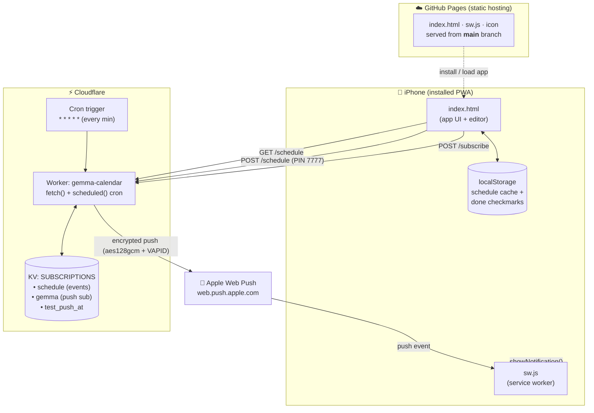
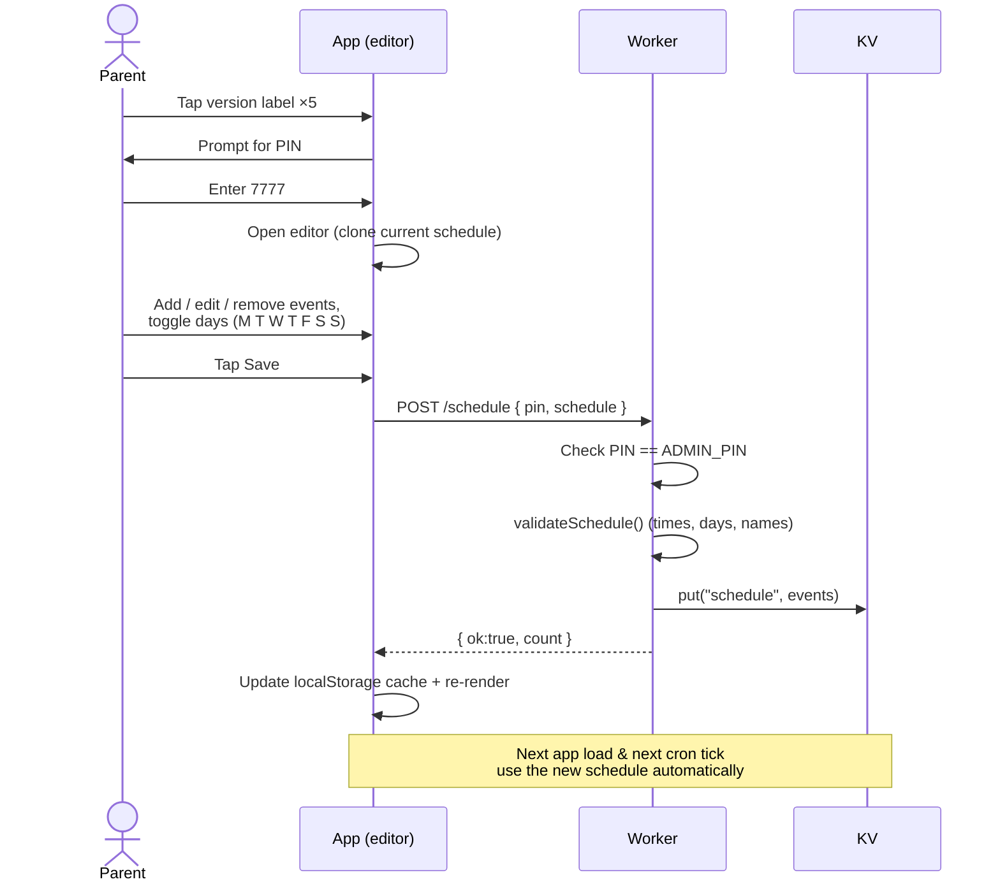
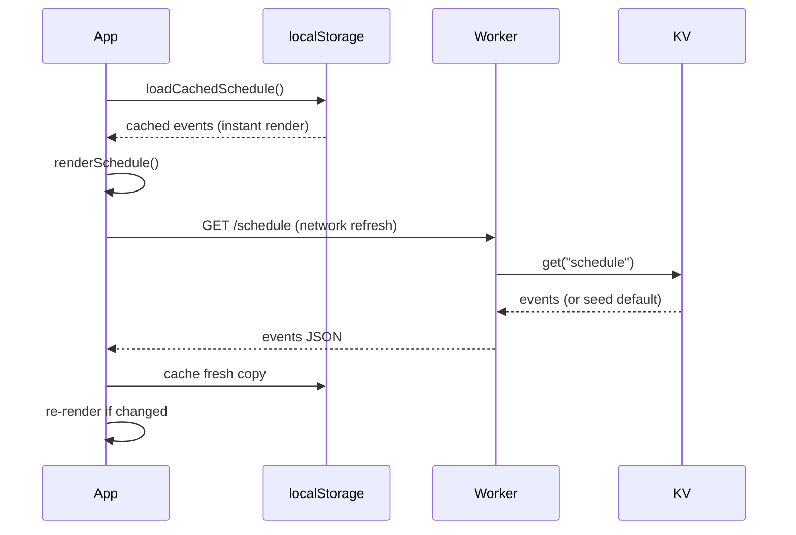
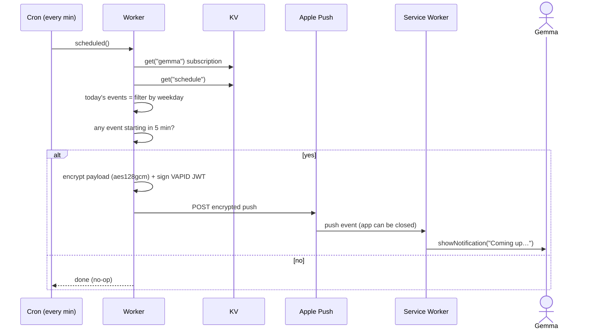
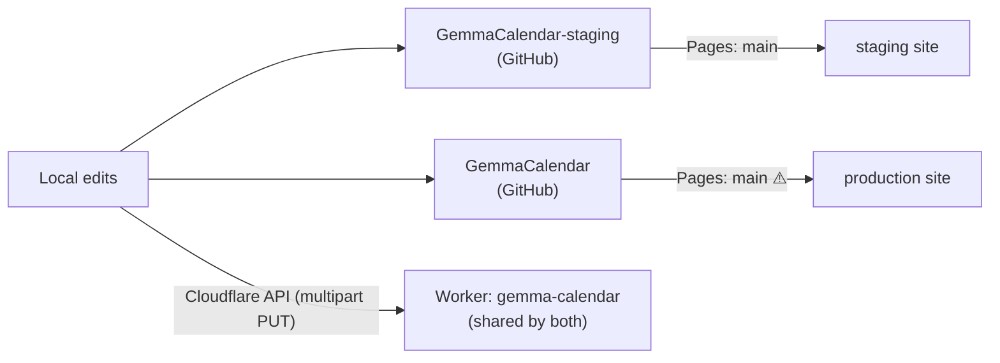

# Gemma Calendar — Architecture & Flows

A PWA daily-schedule tracker for Gemma with editable time slots and iOS background
push notifications. No build tools, no framework — a single HTML file served from
GitHub Pages, backed by a Cloudflare Worker + KV for the schedule and Web Push.

---

## 1. System architecture



**Components**

| Component | Role |
|-----------|------|
| `index.html` | App UI, schedule rendering, PIN-gated editor, push subscription |
| `sw.js` | Service worker — receives background `push` events, shows notifications |
| GitHub Pages | Static hosting (serves from the **`main`** branch for both repos) |
| Cloudflare Worker | HTTP API (`/schedule`, `/subscribe`, …) + every-minute cron |
| Cloudflare KV | Single source of truth: the schedule, the push subscription, test state |
| Apple Web Push | Delivers encrypted notifications to the device, even when the app is closed |

---

## 2. Schedule data model

The schedule is a **flat list of events** stored in KV under the key `schedule`.
This is the single source of truth for **both** the app display and the cron
notifications, so they can never drift apart.

```jsonc
[
  { "id": "e9", "start": "16:30", "end": "18:30", "task": "Tutor Time 📚", "days": [0,1,2,3,4] },
  { "id": "e25","start": "16:30", "end": "18:30", "task": "Art Time 🎨",   "days": [5] }
]
```

- `days` is an array of **0=Mon … 6=Sun** — this is what makes "3 days a week"
  events (e.g. `[0,2,4]` = Mon/Wed/Fri) and weekend-only events trivial.
- `id` is stable, so done-checkmarks survive edits (they track by id, not position).
- If KV has no `schedule` yet, the Worker falls back to a seeded `DEFAULT_SCHEDULE`.

---

## 3. Flow: editing the schedule (PIN-gated)



---

## 4. Flow: app load (offline-friendly)



The cached copy means the app renders instantly and still works offline; the
network fetch quietly refreshes it in the background.

---

## 5. Flow: background notification



**Why aes128gcm:** iOS Safari Web Push requires RFC 8188 `aes128gcm` payload
encryption. The Worker derives the content key via ECDH + HKDF and signs requests
with a VAPID JWT (ES256).

---

## 6. Worker HTTP endpoints

| Method & path | Purpose | Auth |
|---------------|---------|------|
| `GET /schedule` | Return current schedule | none |
| `POST /schedule` | Save schedule `{ pin, schedule }` | PIN |
| `POST /subscribe` | Save device push subscription | none |
| `GET /vapid-public-key` | Return VAPID public key | none |
| `GET /test-push` | Send an immediate test push (staging) | none |
| `GET /schedule-push` | Queue a test push ~60s out (staging) | none |
| `GET /debug-sub` | Show saved subscription endpoint (staging) | none |

---

## 7. Deploy topology



> ⚠️ **GitHub Pages serves production from `main`, not `master`.** Push production
> changes to `main` (e.g. `git push origin HEAD:main`). The Cloudflare Worker is a
> **single shared deployment** used by both staging and production apps.

---

## 8. Roadmap

- **Calendar import** — pull events from Google/Apple Calendar and map them into the
  same `{ start, end, task, days }` event structure already used here.
